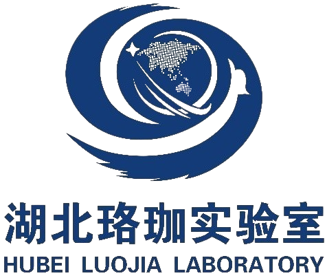
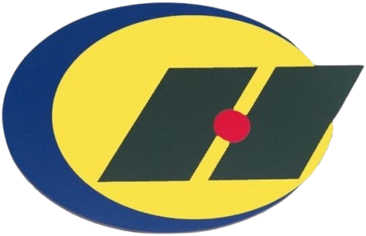

<h1 align="center">

   

</h1>
<h1 align="center">

&nbsp;
&nbsp;
&nbsp;
<!-- &nbsp; -->
<!-- &nbsp; -->
<!-- &nbsp;  -->
&nbsp;
<!-- &nbsp; -->
&nbsp;
&nbsp;

    
    
    
    <!--  -->
    
    
    

  
  
   
   
  <!--  -->
    <!-- <a title="X" target="_blank" href="https://x.com/LuoHongKun2002"> -->
    

</h1>

<a>I'm open to internship and research collaboration opportunities（feel free to reach out! 📬）

<strong>Hongkun Luo</strong>, a M.Eng. candidate at <strong>Wuhan University</strong>. 👉 Curious to know more about me? Just visit my <a href="https://luohongkun.top/" target="_blank"><strong>homepage</strong></a>. 

### 💬 Information

  
<strong>🎓Education & Lab</strong>

  
🌟I attended <a href="https://cesi.cumt.edu.cn/">China University of Mining and Technology</a> as an undergraduate (2020-2024). My GPA is 4.16 out of 5, and I ranked 4th in my major out of 133 students. I ranked first in my major for the overall quality assessment score during the first three years of my undergraduate studies. Now, I am a first year master candidate in geodesy and surveying engineering at <a href="https://www.sgg.whu.edu.cn/">Wuhan University</a>(2024-2027). I am currently doing research in the <a href="https://www.zhiyuteam.com/">Beidou Robotics And Intelligent Navigation laboratory</a>,supervised by <a href="https://jszy.whu.edu.cn/guochi/zh_CN/index.htm">Prof. Chi Guo</a> and <a href="https://gnsscenter.whu.edu.cn/info/1301/1081.htm">Prof. Weiwei Song</a>.

<strong>🏆Awards</strong>

  
🌟I was awarded the <a href="http://www.moe.gov.cn/srcsite/A05/s7505/202401/t20240117_1100766.html"><strong>National Scholarship for Chinese University Students</strong></a> (0.2%) in 2023. Meanwhile, I also won the <a href="https://www.comap.com/contests/mcm-icm">MCM/ICM</a>'s Meritorious Winner (7%), the First Prize of MathorCup Big Data Challenge (5%),the First Prize of the National Electrotechnical Mathematical Modeling Competition for College Students, the Second Prize of the National College Students' Surveying and Mapping Programming Competition, and other various awards.

<strong>🔬Research & Interests</strong>

🌟My research interests are mainly about <strong>🤖robot learning for embodied agents</strong>, especially in the context of <strong>vision-language navigation</strong> and <strong>lifelong localization</strong>. I am particularly interested in:

- **Vision-Language Navigation and Action**  
  Grounding natural language into spatial behaviors for embodied agents.

- **Learning-based Localization and Perception**  
  Including **vision relocalization** and **3D scene understanding** for robust spatial awareness.

- **Efficient 3D Representations**  
  Exploring methods such as **Gaussian Splatting** for robot mapping and planning.

- **Lifelong Navigation**  
  Addressing long-term autonomy in dynamic and large-scale environments.

### 📁 Repositories

  

    
    📂 <a href="https://github.com/luohongk/SuperVINS" style="color: #1e90ff; text-decoration: none; font-weight: bold;">SuperVINS</a> : [JSEN] A Real-Time Visual-Inertial SLAM Framework for Challenging Imaging Conditions.
  

  

    
    📂 <a href="https://github.com/luohongk/CeHuiProgramDesign" style="color: #1e90ff; text-decoration: none; font-weight: bold;">CeHuiProgramDesign</a> : Surveying and Mapping Programming Competition in 2023.
  

  

    
    📂 <a href="https://github.com/luohongk/Awesome-Localization-And-3D-Reconstruction-From-Arxiv" style="color: #1e90ff; text-decoration: none; font-weight: bold;">论文收集</a> : 收集的有关定位，导航，三维重建，VLN/A的相关论文。每天自动更新！issue区是最新10篇论文.
  

### 📊 Github statistics

</table>
